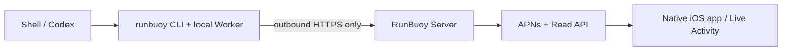

# RunBuoy

**Keep every run in sight.**

RunBuoy sends safe, read-only status for commands, builds, experiments, and
AI agent runs from a Mac or Linux machine to a native iPhone app, Lock Screen
Live Activity, and Dynamic Island.

```bash
runbuoy run -- python3 experiment.py
```

RunBuoy is not a remote terminal, SSH client, mobile tmux client, remote
operations console, or phone-based agent approval tool.

## One-way by design



Execution data flows only `Machine → Server → iPhone`. iPhone can pair,
register its own notification tokens, read Runs/Machines/Messages, change
local receiving preferences, and remove a receiving subscription. It cannot
start, cancel, retry, approve, signal, attach, type into, or otherwise control
a Machine. There is no remote command queue, Machine inbox, WebSocket control
channel, terminal stream, public terminal URL, or tunnel.

## Components

- `cli`: Python 3.12 Typer CLI, tmux-owned Worker, PTY/process groups, local
  SQLite outbox, Unix event socket, progress adapters, and local-only controls
- `server`: FastAPI/SQLAlchemy/Alembic projection service, scoped credentials,
  pairing, webhooks, transactional push outbox, and mock/production APNs
- `apps/ios`: native SwiftUI iOS 18 app plus WidgetKit/ActivityKit extension
- `packages/protocol`: OpenAPI, JSON Schema, and cross-platform fixtures
- `skills/runbuoy`: explicit `$runbuoy` Codex skill
- `infra`: API, worker, and PostgreSQL Docker Compose environment

## Quick start

### 1. Start a local mock server

```bash
cp infra/.env.example infra/.env
docker compose --env-file infra/.env -f infra/docker-compose.yml up --build
```

Mock APNs records exact payloads and requires no Apple credentials.

### 2. Install the CLI

```bash
uv tool install --python 3.12 runbuoy
runbuoy completion install zsh
runbuoy doctor
runbuoy capabilities --json
```

You can alternatively use `pipx install runbuoy`. RunBuoy supports macOS and
Linux and requires Python 3.12 or newer. `tmux` is required for durable Runs;
install it with `brew install tmux` on macOS or your Linux system package
manager. Installation, upgrade, packaging, and release details are in
[`docs/developer-guide/cli-distribution.md`](docs/developer-guide/cli-distribution.md).

Python instrumentation is a separate, optional project install. For a PEP 621/uv project:

```bash
uv add --optional runbuoy runbuoy
uv sync --extra runbuoy
```

The same `runbuoy` distribution is the sole CLI/SDK implementation. If the project does not
install the optional extra, business code should use the documented `NoopReporter` fallback.

### 3. Bootstrap iPhone and pair

Build the native app in `apps/ios`. The hosted service currently uses the
**Global** region for every installation. Configure the same region on every
Machine before pairing:

```bash
runbuoy config set --region global
```

The hosted endpoint is `https://api.runbuoy.cloud`. Independent Mainland China
hosting remains disabled until its network path is production-ready. Then
choose **Pair New Machine**. On the Machine:

```bash
runbuoy device pair
```

Scan the short-lived QR code. The QR has a five-minute, single-use challenge
and no long-lived token. One iPhone installation can pair multiple Machines.

### 4. Run or notify

```bash
runbuoy demo live-activity
runbuoy demo notification

runbuoy config set --machine-name "Build Mac"

runbuoy run -- python3 experiment.py

runbuoy notify \
  --title "Build completed" \
  --body "Release build succeeded" \
  --level success
```

The default remote payload contains a safe title such as
`python · experiment.py`, structured status, progress, safe messages,
timestamps, and exit code. Full argv, cwd, environment, source, stdout,
stderr, terminal frames, input, and credentials stay local.

## Progress

RunBuoy never fabricates percentage or ETA.

Structured progress:

```python
from runbuoy import get_reporter

reporter = get_reporter()
reporter.progress(
    current=37,
    total=100,
    phase="processing",
    message="Processing item 37",
)
```

```bash
runbuoy emit progress \
  --current 37 \
  --total 100 \
  --phase processing \
  --message "Processing item 37"
```

Line progress:

```bash
runbuoy run \
  --progress lines \
  --total 100 \
  --match '^Hello World$' \
  -- python3 script.py
```

Regex progress:

```bash
runbuoy run \
  --title "Gurobi Experiment" \
  --progress regex \
  --pattern '^PROGRESS: ([0-9]+)/([0-9]+)$' \
  -- python3 experiment.py
```

Without an explicit source, the Live Activity shows indeterminate state and
Machine-confirmed elapsed time—never a synthetic percent. The elapsed value
advances only when a new Machine event arrives; a frozen value indicates that
the delivery or display path has not received a fresh confirmation.

## Local-only commands

These commands read or control only local files, tmux, the recorded process
group, or a mode-restricted Unix socket:

```bash
runbuoy list
runbuoy list -a
runbuoy status <run-id>
runbuoy logs <run-id>
runbuoy attach <run-id>
runbuoy cancel <run-id>
```

No Server or iOS endpoint can invoke them. They continue to work when the machine is unpaired or
the Server is unreachable. A detached `runbuoy run --json` returns only after a nonce/Socket ACK
and `run.started` handoff; the caller can then exit while the tmux Worker owns the task.

Other commands:

```bash
runbuoy device pair
runbuoy device status
runbuoy notify
runbuoy demo live-activity
runbuoy demo notification
runbuoy emit progress
runbuoy emit phase
runbuoy emit message
runbuoy emit attention
runbuoy doctor
runbuoy sync --json
runbuoy config show
runbuoy config set --region global
runbuoy config set --region cn
runbuoy config set --server-url https://runbuoy.example.com
runbuoy config path
runbuoy history prune --older-than 30d --dry-run
runbuoy capabilities --json
```

## Explicit safe log tail

Full logs remain local. A bounded, redacted tail is opt-in:

```bash
runbuoy run --share-log-tail 20 -- command
```

The limit is 1–100 lines. ANSI is stripped, line and payload sizes are
bounded, credential patterns are redacted, iOS labels the uploaded excerpt,
and Server retention is at most 24 hours. This is not a terminal stream.

## Webhooks

Revocable webhook credentials use the Authorization header:

```bash
curl -X POST "$RUNBUOY_URL/v1/hooks/$HOOK_ID/notifications" \
  -H "Authorization: Bearer $RUNBUOY_HOOK_SECRET" \
  -H "Content-Type: application/json" \
  -d '{"title":"Build completed","body":"Release build succeeded","level":"success"}'
```

External Run upsert and event paths are:

```text
PUT  /v1/hooks/{hook_id}/runs/{external_run_id}
POST /v1/hooks/{hook_id}/runs/{external_run_id}/events
```

Long-lived secrets never appear in URLs. iOS renders a safe Markdown subset
without HTML, JavaScript, executable schemes, or WebView.

## Live Activity policy

- Automatic Runs still active after five seconds may start a Live Activity;
  CLI Runs can opt into immediate start with `--live-activity immediate`.
- Short success is history-only; short failure receives a normal alert.
- Each Device gets at most two active activities, prioritized by attention,
  failure/warning, then recency.
- With frequent updates enabled, ordinary progress is coalesced to at most one
  update every second; devices that disable frequent updates use 15 seconds, and
  less than 1% changes are suppressed.
- Phase, attention, terminal success, and failure update immediately.
- A heartbeat is emitted every 15 seconds and advances the confirmed elapsed
  time with a low-priority Live Activity update.
- Active payloads become stale 60 seconds after the latest confirmed Machine
  event; terminal payloads end the activity with final state.
- When the iOS app refreshes in the foreground, it compares monotonic Run
  sequences and locally repairs or ends any older Live Activity.
- APNs stores start, update, and end snapshots only for their bounded useful
  lifetime; collapse IDs retain the newest snapshot while a device is offline.
- APNs 410 invalidates the token; retry is bounded.

Production APNs uses HTTP/2, TLS, ES256 provider tokens, current rotating
ActivityKit tokens, and Apple-specified headers/payloads. See
[`docs/developer-guide/apns-setup.md`](docs/developer-guide/apns-setup.md).

## Native iOS

The iOS 18 app is Swift/SwiftUI with ActivityKit, WidgetKit,
UserNotifications, URLSession, Keychain, local cache, and QR scanning. It has
no React Native, Expo, JavaScript runtime, WebView, terminal/SSH/PTY library,
persistent WebSocket, background polling, mutation App Intent, or notification
action.

Build without signing:

```bash
xcodebuild \
  -project apps/ios/RunBuoy.xcodeproj \
  -scheme RunBuoy \
  -destination 'generic/platform=iOS Simulator' \
  CODE_SIGNING_ALLOWED=NO \
  build
```

Signing and physical-device steps are in
[`docs/developer-guide/ios-signing.md`](docs/developer-guide/ios-signing.md).

## Development and tests

```bash
uv sync --group dev
uv run pytest packages/protocol/tests
uv run python scripts/check_read_only_boundary.py

(cd cli && uv sync --all-groups && uv run pytest)
(cd server && uv sync --all-extras && uv run pytest)

./scripts/e2e_smoke.sh
```

CI runs protocol/security, Ruff/mypy, Server tests with PostgreSQL, CLI tests
on Linux and macOS with tmux, unsigned iOS build/tests, and mock-APNs E2E.
See [`docs/developer-guide/development.md`](docs/developer-guide/development.md).

## Documentation

- [Product requirements](docs/product/prd.md)
- [Architecture](docs/design/architecture.md)
- [Protocol](docs/developer-guide/event-protocol.md)
- [Security](docs/design/security.md) and [threat model](docs/design/threat-model.md)
- [Deployment and release guide](docs/developer-guide/deployment-and-release.md)
- [Self-hosting](docs/developer-guide/self-hosting.md)
- [Server operations, backup, and recovery](docs/developer-guide/operations.md)
- [APNs setup](docs/developer-guide/apns-setup.md)
- [CLI distribution and PyPI releases](docs/developer-guide/cli-distribution.md)
- [Code provenance](docs/code-provenance.md)

## Current limitations

- macOS and Linux only; Windows is not an MVP target.
- Anonymous workspaces only; there are no email accounts or teams.
- APNs production delivery requires external Apple credentials and a physical
  signed device and is not exercised by CI.
- Push delivery is best effort; offline Runs remain locally durable and later
  converge.
- Safe log-tail sharing is intentionally bounded rather than real-time.

RunBuoy retains the upstream MIT license and history. See
[`THIRD_PARTY_NOTICES.md`](THIRD_PARTY_NOTICES.md).
