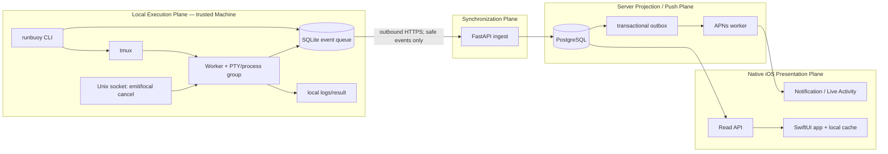
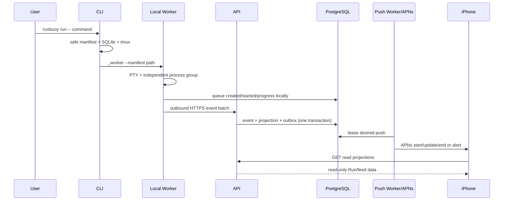

# Architecture

## Planes

There is deliberately no arrow from iPhone or Server to the local execution
plane.

## Run sequence

## Sources of truth

- The target process and final result file are the execution truth.
- Local SQLite is the durable upload and sequence truth.
- tmux provides local persistence and attach only; pane capture is not a
  lifecycle source.
- PostgreSQL stores append-only received events and a derived read projection.
- APNs and iOS caches are presentations, never execution controllers.

## Failure recovery

Events are committed locally before upload. Batches are retried with bounded
backoff; duplicates are accepted idempotently. A stale sequence cannot
regress a projection. Terminal events are uploaded immediately and remain in
the local outbox until acknowledged. After the target exits, the Worker remains
alive for a bounded terminal-delivery window and continues respecting the
outbox backoff schedule. `runbuoy doctor --repair` is the explicit recovery
path for delivery still queued after that window; it retries without changing
local execution state or deleting failed records. Server push work is
transactional with projection changes and retried independently; APNs 410
invalidates the target token rather than retrying forever.

If APNs is unavailable, Runs remain readable. If the Server is unavailable,
the local process continues and events drain after recovery. If a heartbeat
expires, presentation health becomes stale/offline without inventing an
execution transition.

## Trust boundaries

- Local manifests and logs may contain sensitive execution data and use
  restrictive filesystem permissions.
- The Unix socket is local, mode-restricted, and authenticated with an
  ephemeral Run token.
- Machine and Device bearer credentials have non-overlapping scopes.
- Exchange secrets and API credentials are strongly hashed.
- APNs device and activity tokens are encrypted at rest.
- QR payloads are short-lived challenges and never long-lived credentials.
- iOS renders structured data and a safe Markdown subset without WebView.
