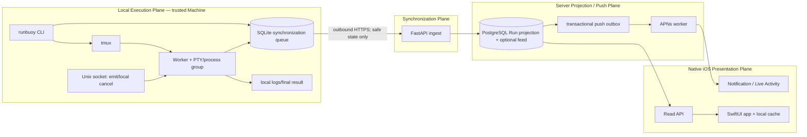
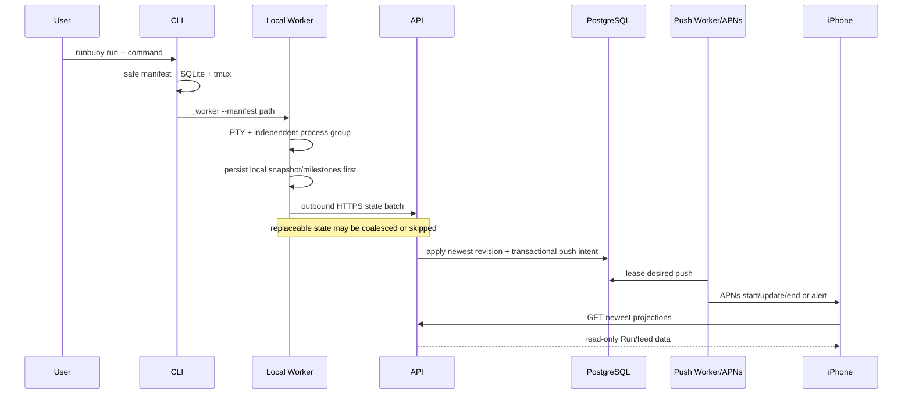

# Architecture

## Planes



There is deliberately no arrow from iPhone or Server to the local execution
plane.

## Run sequence



## Sources of truth

- The target process and final result file are the execution truth.
- Local SQLite is the durable synchronization truth for pending terminal results
  and the newest unsent state.
- tmux provides local persistence and attach only; pane capture is not a
  lifecycle source.
- PostgreSQL stores the newest accepted Run projection and a best-effort
  explanatory feed. It is not required to contain every progress or heartbeat
  sample.
- APNs and iOS caches are presentations, never execution controllers.

## Convergence model

RunBuoy is latest-state-wins and eventually consistent. Per-Run `seq` is a
monotonic revision, not a gap-free log offset.

The Server applies a state update when its revision is newer than the current
projection. An exact duplicate is an idempotent no-op. An older revision is
acknowledged as stale and discarded. Revision gaps are legal.

This makes the following delivery valid:

```text
Machine generated: 10%, 20%, 30%, 40%
Server received:   20%, 40%, then late 10%
Projection:        40%
```

The late 10% update is acknowledged and must not remain in the client retry
queue. The missing 30% sample is not an error because the product needs the
newest useful state, not a complete telemetry history.

### Delivery classes

| Class | Examples | Durability and retry behavior |
|---|---|---|
| Replaceable state | progress, phase, message, attention, heartbeat | Coalesce while pending; newer state supersedes older state; stale updates are acknowledged and dropped |
| Durable milestone | Run creation metadata, terminal snapshot, one-time notification | Persist locally until acknowledged; terminal snapshot is self-contained |

A terminal snapshot contains enough information to converge even when the
Server missed all intermediate updates.

## Weak execution state machine

Execution status remains useful, but only the trusted local Worker or local
reconciler may produce execution transitions:

```text
CREATED → STARTING → RUNNING → SUCCEEDED | FAILED | CANCELLED | LOST
```

The Server must not derive `FAILED` or `LOST` from missing network traffic.
Heartbeat loss, APNs delay, Machine sleep, Server restart, or an intermittent
connection only change presentation freshness.

`LOST` is emitted only after local reconciliation confirms that the Worker,
target process group, tmux session, and final result are unavailable under the
local policy.

## Soft health and freshness

Health is a UI hint derived from Server receipt time rather than a hard Run
transition. Defaults:

```text
< 5 minutes     no warning
5–30 minutes    Updates may be delayed
> 30 minutes    Status currently unavailable
```

The last known progress is retained. The UI shows `last updated` with neutral
language and does not convert uncertainty into failure.

Heartbeat defaults to 60 seconds. Progress, phase, message, attention, and
terminal updates also count as activity. Pending heartbeats are coalesced and do
not cause APNs directly.

## Failure recovery

State is committed locally before upload. Retries use exponential backoff with
jitter. Replaceable state is compacted to the newest pending value; terminal
snapshots remain durable until acknowledged.

If APNs is unavailable, Runs remain readable through the Read API. If the Server
is unavailable, the local process continues and the newest state drains after
recovery. If APNs delivery is lost, App foreground refresh converges from the
Read API.

A stale sequence is a successful no-op, not a retryable failure. This prevents
old progress from becoming a permanent queue poison record after newer progress
has already been applied.

The default Live Activity stale horizon is 10 minutes. Staleness keeps the last
known progress and adds a neutral age indication. Only an explicit terminal
snapshot ends the Activity as success, failure, cancellation, or loss.

## iOS compatibility

The functional deployment baseline is iOS 18. iOS 26 presentation features,
including Liquid Glass, are optional enhancements behind `#available(iOS 26, *)`
with complete iOS 18 fallbacks.

The current repository includes an iOS 26-targeted visual revision. That is an
implementation gap against the accepted product architecture, not a new product
minimum.

## Trust boundaries

- Local manifests and logs may contain sensitive execution data and use
  restrictive filesystem permissions.
- The Unix socket is local, mode-restricted, and authenticated with an
  ephemeral Run token.
- Machine and Device bearer credentials have non-overlapping scopes.
- Exchange secrets and API credentials are strongly hashed.
- APNs device and activity tokens are encrypted at rest.
- QR payloads are short-lived challenges and never long-lived credentials.
- iOS renders structured data and a safe Markdown subset without WebView.
